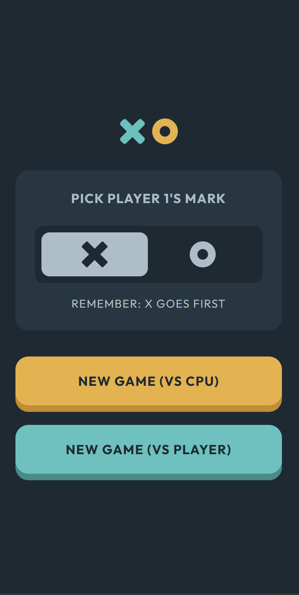
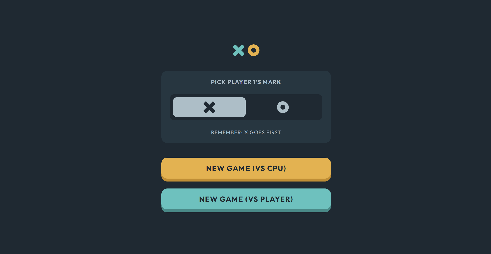
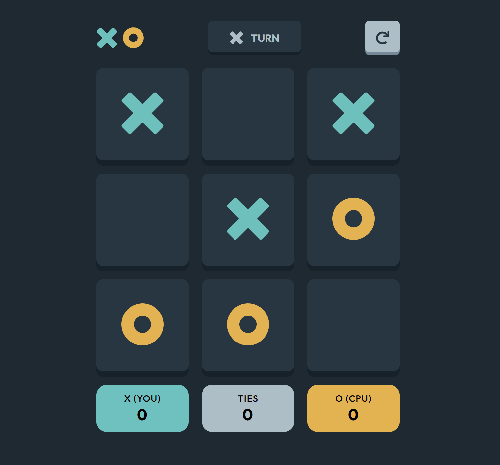
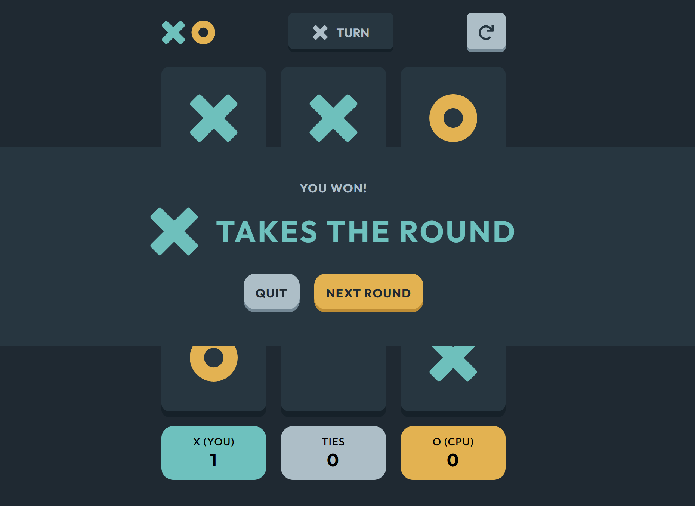

# Frontend Mentor - Tic Tac Toe solution

This is a solution to the [Tic Tac Toe challenge on Frontend Mentor](https://www.frontendmentor.io/challenges/tic-tac-toe-game-Re7ZF_E2v). Frontend Mentor challenges help you improve your coding skills by building realistic projects.

## Table of contents

- [Overview](#overview)
  - [The challenge](#the-challenge)
  - [Screenshot](#screenshot)
  - [Links](#links)
- [My process](#my-process)
  - [Built with](#built-with)
  - [What I learned](#what-i-learned)
  - [Useful resources](#useful-resources)
  - [AI Collaboration](#ai-collaboration)
- [Author](#author)

## Overview

### The challenge

Users should be able to:

- View the optimal layout for the game depending on their device's screen size
- See hover states for all interactive elements on the page
- Play the game either solo vs the computer or multiplayer against another person
- **Bonus 1**: Save the game state in the browser so that it’s preserved if the player refreshes their browser
- **Bonus 2**: Instead of having the computer randomly make their moves, try making it clever so it’s proactive in blocking your moves and trying to win

### Screenshot

### Links

- Solution URL: [Github](https://github.com/KrisvHeij/tic-tac-toe-game)
- Live Site URL: [Github Pages](https://krisvheij.github.io/tic-tac-toe-game/)

## My process

### Built with

- Semantic HTML5 markup
- CSS custom properties
- Javascript
- Flexbox
- CSS Grid
- Mobile-first workflow

### What I learned

This is the first project where I implemented modules in my javascript to keep things organized and separated.

### Useful resources

- [MDN Docs](https://developer.mozilla.org/en-US/) - This is my go-to site looking up methods I want to use.

### AI Collaboration

I used Claude with the instruction to be my mentor/coach. I used it to give me hints whenever I got stuck. And regularly asked it to review my code.

## Author

- Frontend Mentor - [@krisvheij](https://www.frontendmentor.io/profile/krisvheij)
